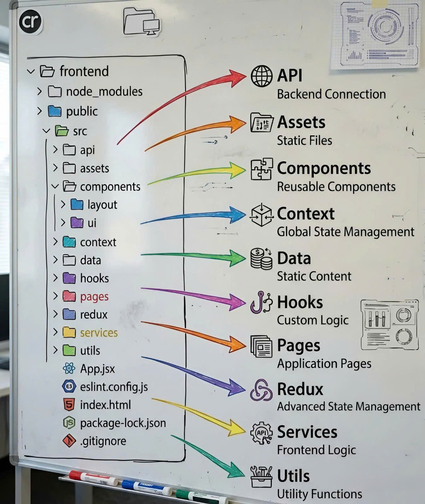

# React Enterprise Boilerplate

A scalable and well-structured React + TypeScript project architecture
designed for enterprise-level applications.

---

## 📁 Project Structure



    react-enterprise-boilerplate/
    │
    ├── public/                 # Static assets (favicon, static images, etc.)
    │
    ├── src/
    │   ├── assets/             # Images, fonts, icons, global styles
    │   ├── components/         # Reusable UI components (Button, Modal, Input...)
    │   ├── constant/           # Application-wide constants and enums
    │   ├── features/           # Business logic modules (feature-based structure)
    │   ├── hooks/              # Custom React hooks
    │   ├── layouts/            # Layout components (MainLayout, AuthLayout...)
    │   ├── pages/              # Page-level components mapped to routes
    │   ├── routes/             # Application routing configuration
    │   ├── store/              # Global state management (Redux/Zustand/etc.)
    │   │
    │   ├── App.tsx             # Root application component
    │   ├── App.css             # App-level styles
    │   ├── index.css           # Global styles
    │   ├── main.tsx            # Application entry point
    │   └── vite-env.d.ts       # Vite TypeScript definitions
    │
    ├── index.html              # Root HTML template
    ├── package.json            # Project dependencies and scripts
    ├── package-lock.json       # Dependency lock file
    ├── tsconfig.json           # TypeScript configuration
    ├── tsconfig.node.json      # Node-specific TypeScript configuration
    ├── vite.config.ts          # Vite configuration
    └── README.md               # Project documentation

---

## 🧠 Architectural Principles

### 1️⃣ Separation of Concerns

Each folder has a clear responsibility: - UI components →
`components/` - Business logic → `features/` - Layout structure →
`layouts/` - Routing → `routes/` - Global state → `store/`

This ensures maintainability and scalability.

---

### 2️⃣ Feature-Based Structure

Business logic is grouped by feature inside the `features/` directory.\
Each feature can contain: - components - services - hooks - slices (if
using Redux) - types - utils

Example:

    features/
    └── auth/
        ├── components/
        ├── services/
        ├── hooks/
        ├── auth.slice.ts
        └── types.ts

---

### 3️⃣ Reusability & Composability

Shared UI components are placed inside `components/` to maximize reuse
across features.

---

### 4️⃣ Scalable State Management

Global state is managed inside `store/`, allowing: - Centralized state
handling - Predictable data flow - Easy debugging

---

## 🚀 Getting Started

### Install dependencies

```bash
npm install
```

### Run development server

```bash
npm run dev
```

### Build for production

```bash
npm run build
```

---

## 📦 Tech Stack

- React
- TypeScript
- Vite
- Modern State Management (Redux/Zustand)
- Modular Architecture

---

## 👨‍💻 Author

Le Minh Vuong
Email: vuongdev09@gmail.com
